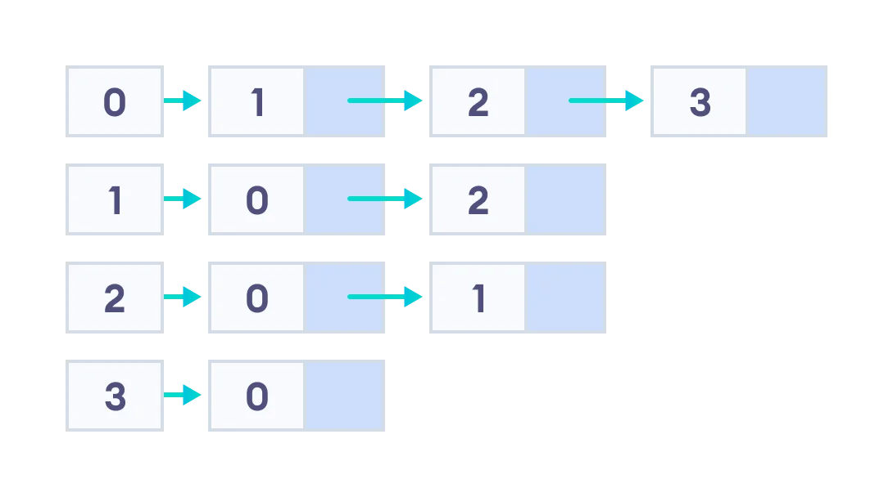

# Combinational Circuit Logic Simulation Tool

### Objective

Implement a logic simulation tool in `C` language for combinational circuits. Logic simulation is defined as the process of applying values at the primary inputs (input vector) and observe and report the values at the primary outputs (output response).

### Input Files

1. `.isc`: This file is the encoding of the combinational circuit layout.
2. `.vec`: This file contains information about the input vectors (values at the primary inputs). Each line in this file is a input vector. Each character is an input of the circuit. A character can take values:
    * `0`: logic zero
    * `1`: logic one
    * `x`: don't care value. During simulation, the `x` is interpreted as `2`.
3. `.faults`: This file contains information about the fault nodes and its struck at value of a particular circuit. Each line in this file is about the single stuck-at fault. Example:
    * `3\1` &#8594; gate with the id `3` has struck-at the value `1`

### Exercises

1. Understand how the data structures and graphs have been programed. Structure `NODE` is an adjacency list where for each node we have linked lists of all its predecessor and successor nodes that represent `fanin` and `fanout` of that node.



2. Traverse the graph `G`. The nodes are already labeled in topological order. The focus will be to learn how to traverse a linked list for each node `V`.

3. Create arrays to store the truth tables for the three basic functions:
    * AND
    * NAND
    * OR
    * NOR
    * XOR
    * XNOR
    * INV
    * BUFFER

4. Determine the logic values at the output of node `V` after traversing the linked list of its predecessors.

5. Apply the input pattern to the primary input of circuit and propagate these values to the primary output of the circuit.

6. Write a function to read the `.faults` file and store the information in the `FAULT` structure.

7. Take a single input vector in the `PATTERN` structure

8. Apply the input pattern to the primary input of the circuit (`x` is mapped to `2`) and propagate these values to the primary output of the circuit. The response obtained at the primary outputs is called __fault free__ response of the circuit.

9. Print the input vector, input vector after `x` has been mapped, and output response for each pattern in the output file.

10. Build a single fault in the `FAULT` structure. Inject the faut in the particular node and propagate the faulty value to the primary output. The output response obtained after injecting the fault is called __faulty__ response of the circuit.

11. Compare the __fault free__ and the __faulty__ response to identify whether the fault at particular node is identified by the given input pattern or not.

12. Log whether the fault is detected or not in the output file.

13. Repeat the steps 10 - 12 for each fault in the `FAULT` structure for the single input pattern.

14. Repeat steps 7 - 12 for each input vector in the `PATTERN` structure of the given circuit.

### Submission

Simulate every input vector and report the corresponding logic responses at the primary outputs for all given circuits. The input pattern and its output response should be saved in an output file. Submission requires:
1. All the program code files.
2. Generated result file for each combinational circuit (one file with input pattern and its output response). The output file contains all the information in the order exactly as the given .vec file.

## The ISCAS '85 benchmark circuits and netlist format

Suppose the following entry in an `.isc` file:
```
    1     1gat inpt    1   0      >sa1
```

This means that:
1. The node address is `1`
2. The node name is `1gat`
3. The node type is `inpt`
4. The node fanout is `1`
5. The node fanin is `0`
6. The node fault(s) is `>sa1`, which maps to _stuck-at 1_

There is another kind of line, the _fanin_ line. The fanin line provides a list of the addresses of the nodes that fan in to the gate driving this node. It always appears immediately after its associated node line. Note that primary inputs do not have a fanin line because, by definition, primary inputs have a fanin of `0`. Also, the number of addresses appearing on the fanin line will equal the fanin reported on the node line. Example:
```
     1     8
```

Looking at the node with address 10 in the `c17` example, we see it has a fanin of 2 and the two fanin addresses are 1 and 8. The node with address 1 is a primary input and the node with address 8 is a fanout branch (type `from`).

The last kind of lines is the _fanout_ branch line. Fanout branch lines are similar to node lines in that they have an address, a name and a type (always from), but the information is associated with a single fanout branch of a fanout stem. Fanout branch lines must appear immediately after the node line (and its fanin line) with which they are associated. Since fanout branches always have a fanout and a fanin of one, this information is not listed as with a node line. Instead, the name of the fanout stem is given after the type. This is redundant information, but, nevertheless, it is part of the format. As a consequence of having a fanout of one, fanout branches may never represent a primary output since primary outputs always have a fanout of zero. Also, note that nodes with a fanout less than or equal to one do not have fanout branches. If the fanout is greater than one, the number of fanout branch lines will equal the fanout reported on the node line. Example:

The node with address `16`, named `16gat`, is type `NAND`, has a fanout of 2 and a fanin of 2. Immediately following the node line is the _fanin_ line which lists node addresses `2` and `14` as the inputs: a _primary input_ and a _fanout branch_ of a `NAND` gate. Following the fanin line are the 2 _fanout branch_ lines; one for each fanout. The netlist then continues with the next node.

More information on the ISCAS '85 benchmark can be found [here](https://davidkebo.com/documents/iscas85.pdf).

## TODO

- [x] split logic functions into _fault_ and _correct_
- [x] update docstrings in `logic.cpp` with respect to the changes described above
- [x] update the function list inside `graph.hpp`
- [x] implement the two `logger.cpp` functions
- [x] spaces between all flow control routines
- [x] ask about the unknown command line argument
- [ ] trim all whitespace from all files
- [x] ask about the project deadline extension
- [ ] "typecast" the whole project from C++ to C
